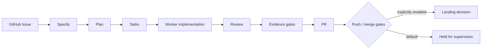

# Positron

[](https://github.com/Mueller-Systems-Lab/Positron/actions/workflows/quality-gates.yml)
[](LICENSE)

**Evidence-gated GitHub issue-to-PR orchestration for supervised autonomous coding workflows.**

Positron is for teams and maintainers who want LLM workers to move a GitHub Issue through Specify, Plan, Tasks, implementation, review, evidence, and a gated PR while one controller retains authority over routing, promotion, retries, and completion.

Developed by [Mueller-Systems-Lab](https://github.com/Mueller-Systems-Lab). Positron remains an independent product identity.

> Stable release `v0.1.0` is published. Fake/demo mode is the safe way to explore Positron. Use the Operator Readiness view before supervised work. The supervised Full Real Mode validation in [#308](https://github.com/Mueller-Systems-Lab/Positron/issues/308) is complete; unsupervised productive Real Mode remains gated and is not enabled by this release.

## Try it in one command

Run the read-only install doctor first. It checks the safe demo prerequisites
and explains any blocker without installing packages or changing credentials.

```bash
./scripts/doctor.sh --demo
```

Prerequisite: Docker Compose v2.

```bash
./scripts/quickstart.sh
```

Windows PowerShell:

```powershell
powershell -ExecutionPolicy Bypass -File .\scripts\quickstart.ps1
```

The demo path generates local ignored credentials, starts fake adapters and an isolated local stack, waits for `/api/health`, and prints the local UI URL. It does not require a GitHub token, OpenCode, SpecKit, manual Redis setup, or editing an environment file.

Useful commands:

```bash
./scripts/quickstart.sh --status
./scripts/quickstart.sh --stop
./scripts/doctor.sh --demo
./scripts/doctor.sh --supervised
./scripts/doctor.sh --demo --json
```

See [Getting Started](docs/getting-started/README.md) for prerequisites, troubleshooting, local development, and the explicitly configured advanced integrations path.

## What works today

| Capability | Status | Evidence / boundary |
| --- | --- | --- |
| Evidence-gated issue-to-PR pipeline | PROVEN | Fake/demo execution and phase evidence in the repository |
| Controller-owned orchestration | PROVEN | [Architecture overview](docs/architecture.md) and durable control-plane evidence |
| Durable run/job/attempt state and deterministic gates | PROVEN | [Durable control plane](docs/architecture/durable-control-plane.md) |
| Safe fake/demo UI and local browser workflow | DEMO | `scripts/quickstart.sh`, current screenshots, route-smoke checks |
| GitHub, SpecKit, OpenCode adapters | GATED | Explicit mode and credential/tool configuration required |
| Unsupervised productive Real Mode | DEFERRED | Supervised validation is complete; unsupervised operation remains owner-gated |
| Positron production deployment | DEFERRED | Not part of this repository-polish scope |
| Heterogeneous worker governance and evidence control plane | PROVEN | [Post-#447 architecture](docs/architecture/architecture-after-consolidation.md) and [portfolio evidence](docs/evidence/issue-447/issue-447-final-report.md) |

Status vocabulary is intentional: **PROVEN** means backed by current repository evidence, **GATED** means available only behind explicit controls, **DEMO** means safe local exploration, **EXPERIMENTAL** means incomplete or subject to change, and **DEFERRED** means intentionally out of scope or blocked.

## Screenshots

Fresh, privacy-reviewed captures from the current demo-safe stack live in [`docs/assets/screenshots/`](docs/assets/screenshots/). Historical captures remain under [`docs/screenshots/`](docs/screenshots/) and are not presented as current proof.

## Safety boundaries

Positron is designed so the controller is the only control authority and LLMs are workers. Important defaults are conservative:

- GitHub, SpecKit, and OpenCode default to `fake` unless explicitly set to `real`.
- `POSITRON_ENABLE_PUSH=false` and `POSITRON_ENABLE_MERGE=false` keep external writes disabled.
- `POSITRON_MERGE_KILL_SWITCH=true` remains the emergency merge stop.
- Demo mode has no host OpenCode/SpecKit mounts and does not need a GitHub token.
- Evidence, tests, review, and workspace boundaries are part of progression; a successful worker response is not completion by itself.

Read [SECURITY.md](SECURITY.md) and [Known Limitations](docs/status/known-limitations.md) before configuring real integrations.

## How the workflow fits together



The web app is an operator cockpit for runs, evidence, repositories, projects, evolution, settings, and admin diagnostics. The backend and worker share durable state; Redis is optional for local inline development and explicit in the advanced Docker stack.

## Development paths

### Local Node development

```bash
npm ci
npm run build
npm run dev:server
# in another terminal
npm run dev:web
```

Use fake modes for local work. The server needs repository configuration; copy `.env.example` to `apps/server/.env` only for a deliberate local setup, or use the one-command Docker demo above.

### Advanced Docker / real integrations

The root `docker-compose.yml` is the advanced full-stack path. It requires explicit `REDIS_PASSWORD` and `POSITRON_ADMIN_TOKEN` values and assumes host OpenCode/SpecKit paths. It is not the quickstart. Configure real modes and a GitHub token only after reading [advanced installation](docs/install/advanced.md) and [SECURITY.md](SECURITY.md).

## Repository map

| Path | Purpose |
| --- | --- |
| `apps/web/` | React/Vite operator cockpit |
| `apps/server/` | Express API and controller runtime |
| `apps/worker/` | Redis/BullMQ worker runtime |
| `packages/` | adapters, state, sandbox, control-plane, and shared contracts |
| `docs/status/` | living current capabilities and limitations |
| `docs/evidence/` | dated, immutable verification records |
| `site/` | dependency-free public landing page |

## Quality and contribution

Run the relevant checks before opening a PR:

```bash
git diff --check
npm run build
npm run typecheck
npm test
npm run test:route-smoke
```

The full local and CI truth is recorded in [Current Capabilities](docs/status/current-capabilities.md). Historical test totals remain in dated evidence and are not maintained as marketing badges.

- [Live website](https://mueller-systems-lab.github.io/Positron/)
- [Documentation index](docs/README.md)
- [Architecture](docs/architecture.md)
- [Security](SECURITY.md)
- [Current status](docs/status/current-capabilities.md)
- [Contributing](CONTRIBUTING.md)
- [License](LICENSE)
