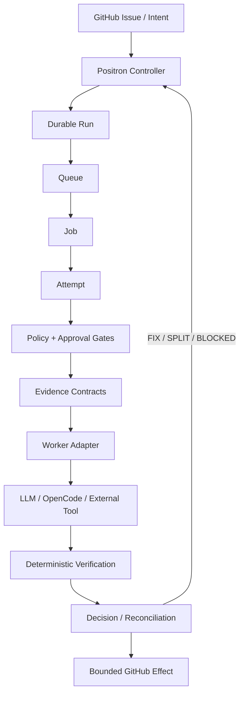
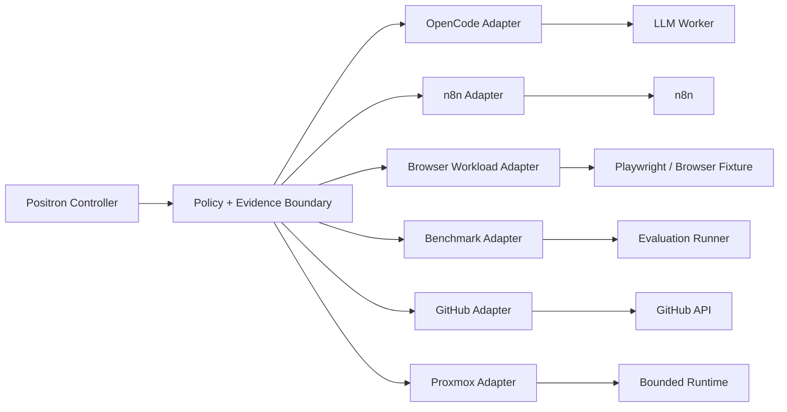
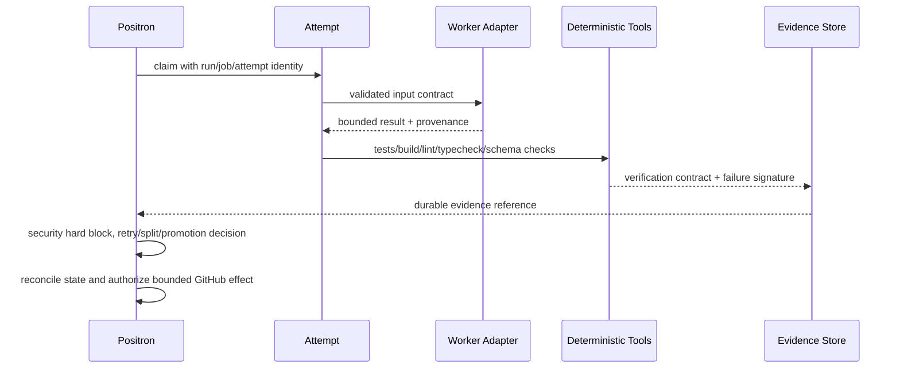
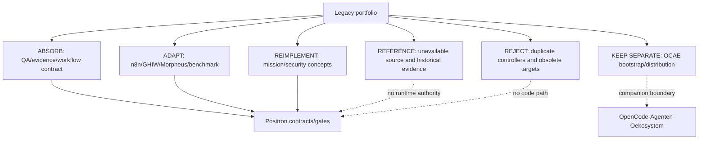

# Positron Architecture After #447

Status: proposed/frozen for PR review on 2026-08-30. This is a consolidation
map, not a second runtime architecture.

## Canonical controller topology

There is one lifecycle authority: Positron. Workers return bounded results;
they cannot advance the lifecycle, approve themselves, retry blindly, promote
themselves or mutate GitHub directly.

## Adapter topology

`n8n`, Proxmox, browser automation and benchmarks are integrations behind the
boundary. None is allowed to become a passive-observer-to-Positron controller.

## Evidence and decision flow

## Legacy disposition map

## Invariants

| Invariant | Result |
|---|---|
| New control planes | `0` |
| LLM role | Worker only |
| External system authority | Adapter request only |
| Protected workflow deletion | Denied by policy |
| DeepSeek agent use | `0` |
| Paid model calls | `0` |
| Source repository mutation | `0` |
| OCAE | Separate companion OSS distribution/governance layer |
