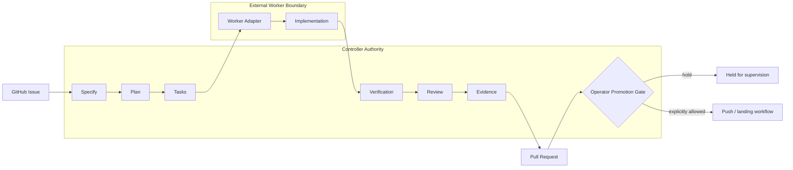
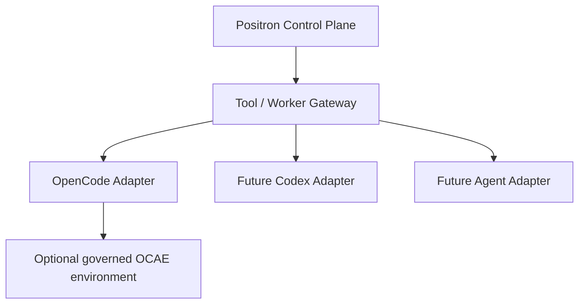
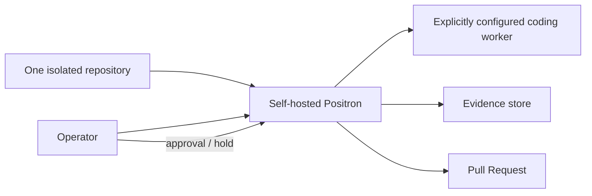

# Evidence-Gated Delivery Control

This document is the product-facing architecture view of Positron's existing supervised control-plane model.

## Product thesis

Positron is not positioned as another coding model or IDE agent. It is a control plane that moves work from a repository issue to a pull request through explicit, inspectable gates.



## Authority model

The controller owns progression. Workers may propose and implement changes but do not decide that work is complete.

Core invariant:

```text
worker success != workflow completion
```

Completion requires the configured evidence and promotion gates.

## Adapter boundary

The commercial architecture should preserve worker independence:



OCAE is therefore optional and must not become a required Positron runtime dependency. Its role is a governed OpenCode worker environment, not the Positron control authority.

## Supported external-evaluation shape



Safety defaults for this shape:

- one explicitly configured repository;
- least-privilege credentials;
- push opt-in;
- merge disabled;
- unsupervised productive mode disabled;
- operator-visible evidence;
- no automatic authority escalation by a model.

## Customer-visible surfaces

The supported product should emphasize:

1. repository onboarding and readiness;
2. issue/run initiation;
3. run phase/status;
4. worker/model identity;
5. verification results;
6. evidence and changed files;
7. pull-request outcome;
8. blocked/held states and the exact reason;
9. operator-controlled promotion.

Development-only benchmark/evaluation machinery should remain outside the primary customer workflow unless it is required to explain a supported capability.

## Non-goals

This architecture does not require:

- an in-house foundation model;
- autonomous merge authority;
- provider lock-in;
- replacing repository-native review;
- replacing project tests;
- moving customer source code to a Positron-operated cloud service.

## Relationship to existing architecture

This view does not replace the detailed internal architecture documents. It is a stable product-level map that should be updated whenever the real control/data/file flow changes materially.
