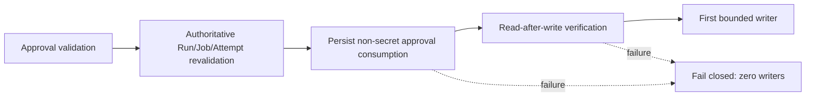

# Issue #308 — Durable Evidence Reconciliation

This document defines the additive durability contract for the supervised
Stage 3 control plane. It does not authorize another Stage 3/4 execution and
does not change sandbox PR #1.

## Decisions

`cp_decisions` is historical evidence. A decision row is never rewritten or
deleted. When later authoritative evidence proves a different terminal result,
the controller appends one row to `cp_decision_reconciliations` referencing the
original decision, Run/Job/Attempt, evidence references and SHA-256 hashes.

Readers expose both views:

- `listDecisions` / `decisions`: the immutable historical record;
- `listDecisionReconciliations` / `decision_reconciliations`: additive
  provenance;
- `resolveEffectiveDecision`: deterministic effective state. Resolution is
  tied to the referenced source decision and an ordinal, not wall-clock order.

An identical reconciliation is idempotent. A conflicting reconciliation for
the same source decision fails closed. Reconciliation time is never presented
as the original event time.

## Approval authority

For future supervised real mutations, the controller performs this sequence:

`cp_approval_consumptions` stores the approval fingerprint and exact effect
binding: repository identity, base SHA, manifest/file/commit/PR hashes,
expiry, Run/Job/Attempt, lease/lock generations and idempotency identity. It
never stores a PAT, token, authorization header, or secret environment value.

Approval fingerprints and idempotency keys are single-use. Replay, attempt
rebinding, manifest substitution, base-SHA substitution, expiry and durable
persistence failures reject the run before a writer call. A restart after
consumption therefore cannot turn one approval into a second write authority.

## Retrospective evidence

The bounded `reconstructApprovalConsumption` function is for already-completed
runs whose native approval record was absent. It requires source references and
hashes and persists `reconstructed = true` and
`original_native_persistence = false`. It does not claim that the original run
had native approval persistence and cannot rewrite historical timestamps or
decisions.

Issue #308’s retrospective record may be created only after this durability
fix is on canonical main. The known credential status remains
`STAGE3_CREDENTIAL_REVOCATION=OWNER_ACTION_REQUIRED`; no Stage 3 credential is
used by this closure work.
