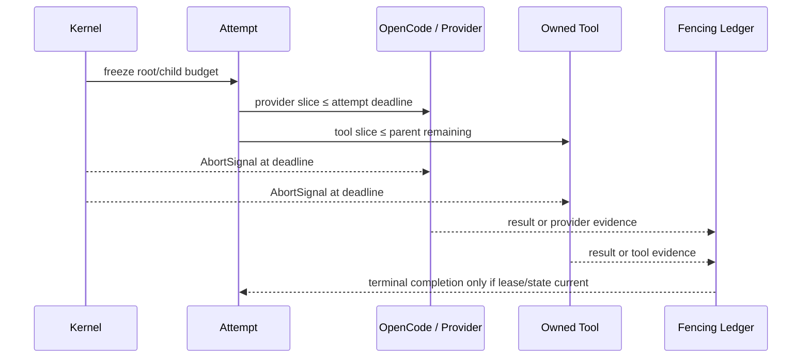

# Issue 478 — Runtime Budget Contract Evidence

## Scope boundary

This change hardens Positron experiment/runtime budget semantics. It does not prove or productize an exploration strategy, reopen or reinterpret Issue #476, start a new experiment, or change production routing.

## Runtime contract

`positron.runtime-budget.v1` is created and frozen by kernel-owned code before a controlled attempt. It records a bounded policy, provider/model identity where known, parent reference, provenance, and a deterministic `budget_fingerprint`. Runtime deadlines use a monotonic epoch clock (`performance.timeOrigin + performance.now()`); `issued_at` is audit-only and cannot extend a deadline.



## Reason-code contract

| Reason | Authority | Interpretation |
| --- | --- | --- |
| `PROVIDER_TRANSPORT_TIMEOUT` | provider | request transport budget elapsed |
| `PROVIDER_QUEUE_TIMEOUT` | provider | provider queue budget elapsed |
| `MODEL_INFERENCE_TIMEOUT` | model | inference budget elapsed |
| `TOOL_EXECUTION_TIMEOUT` | tool | owned tool budget elapsed |
| `ATTEMPT_DEADLINE_EXCEEDED` | attempt | workload exceeded attempt budget |
| `VERIFICATION_DEADLINE_EXCEEDED` | verification | verifier exceeded budget |
| `EXPERIMENT_CELL_DEADLINE_EXCEEDED` | experiment_cell | cell envelope elapsed |
| `RUN_BUDGET_EXHAUSTED` | run | parent budget exhausted |
| `CANCELLED_BY_KERNEL` | kernel | controller cancellation |
| `LATE_RESULT_FENCED` | fencing | late/superseded result rejected |
| `RUNTIME_TERMINATION_UNKNOWN` | kernel | no authoritative termination evidence |

## OpenCode chain

The local CLI is `1.18.23`. OpenCode's official configuration documents provider request `timeout` (default `300000ms`) and streamed `chunkTimeout`; Zen is documented as a provider/gateway. Positron treats those as subordinate provider controls:

```text
OPENCODE_PROVIDER_TIMEOUT = provider configuration / adapter legacy default
OPENCODE_PROCESS_TIMEOUT  = Positron command runner effective slice
POSITRON_DEADLINE         = frozen monotonic attempt/run deadline
EFFECTIVE_TIMEOUT_CHAIN   = min(provider/tool request, attempt deadline, parent deadline)
```

Sources: [OpenCode configuration](https://dev.opencode.ai/docs/config), [OpenCode Zen](https://dev.opencode.ai/docs/zen).

## Experiment boundary

Calibration and holdout partition fingerprints must be non-empty and disjoint (`CALIBRATION_HOLDOUT_INTERSECTION=0`) before holdout execution. A post-holdout budget mutation is `EXPERIMENT_CONTRACT_CHANGED`; historical Issue #476 evidence remains unchanged under its original contract.
